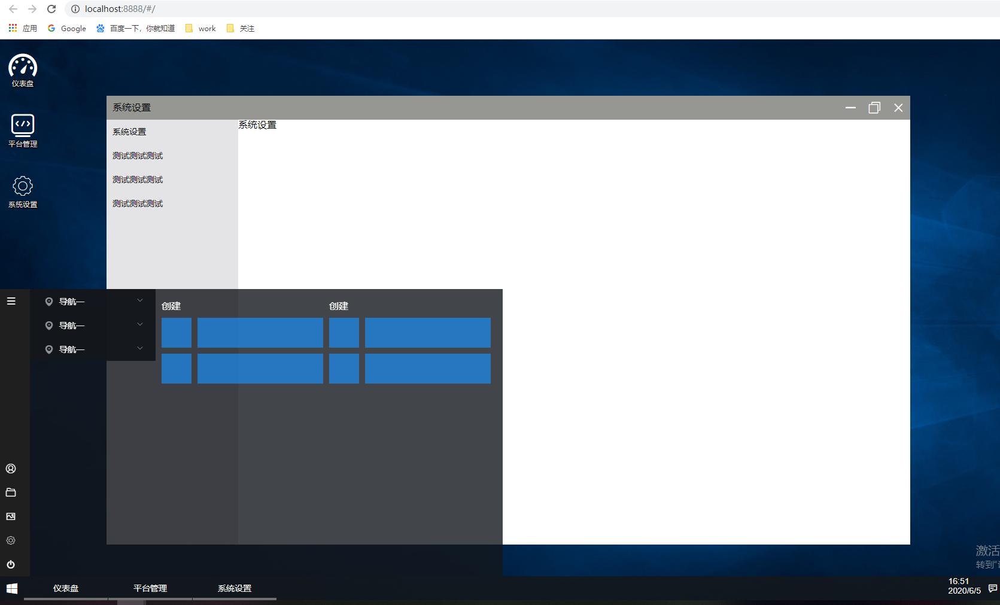

<p align="center">

</p>

<h3 align="center">用vue+KOA2构建window10风格的管理系统</h3>

<p align="center">
  <a href="">
    更新日志
  </a>
  <span> | </span>
  <a>
    中文
  </a>
</p>

> 用vue+KOA2构建window10风格的管理系统,前后端高度集成

## 更新日志

2020-06 创建项目 
注意：目前核心代码并未上传，可先Fork
## 贡献
 有兴趣的同学可以切一个分支（以您的github账号命名分支），发起 pull request 

## window10风格的管理系统

- **前端** 主要部分引用element-ui,vue,vuex构建
-  **后端** KOA2


#### 构建和设置

``` bash
# install dependencies
npm install

# 启动前端界面
npm run dev

# 启动服务端
npm run server

# 同时启动前后端
npm run start
# build for production with minification
npm run build

```

## License

[MIT](http://opensource.org/licenses/MIT)
